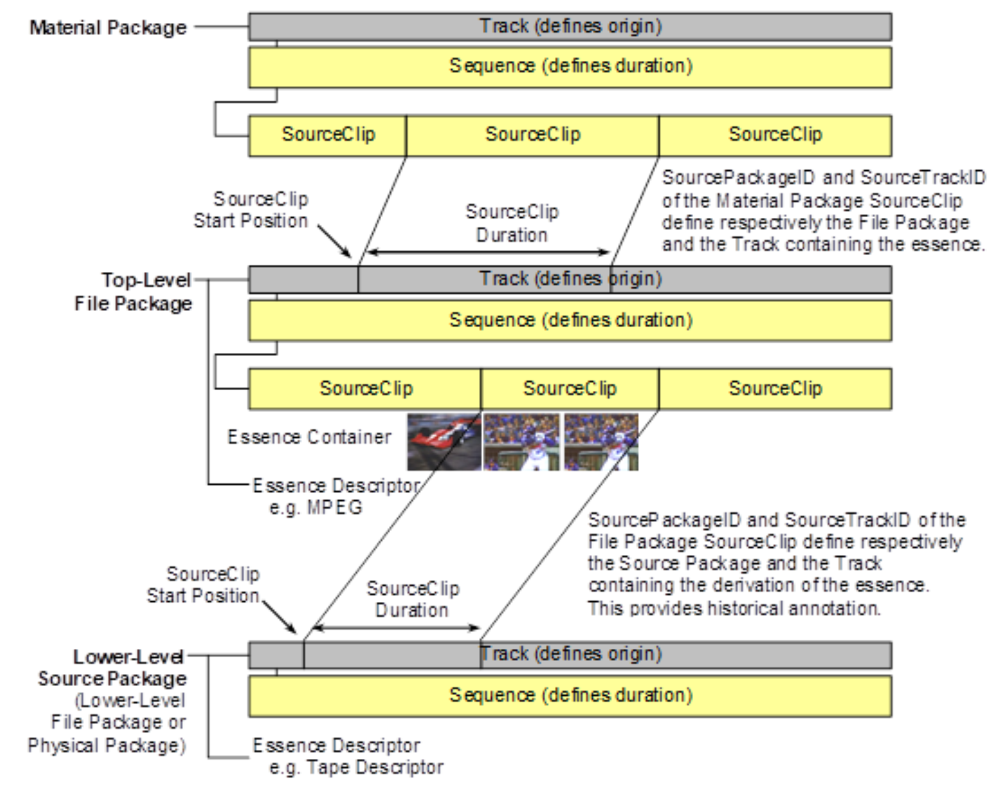
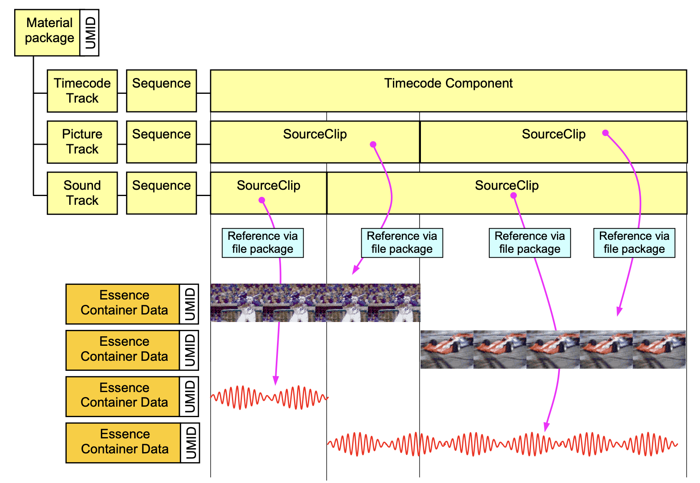
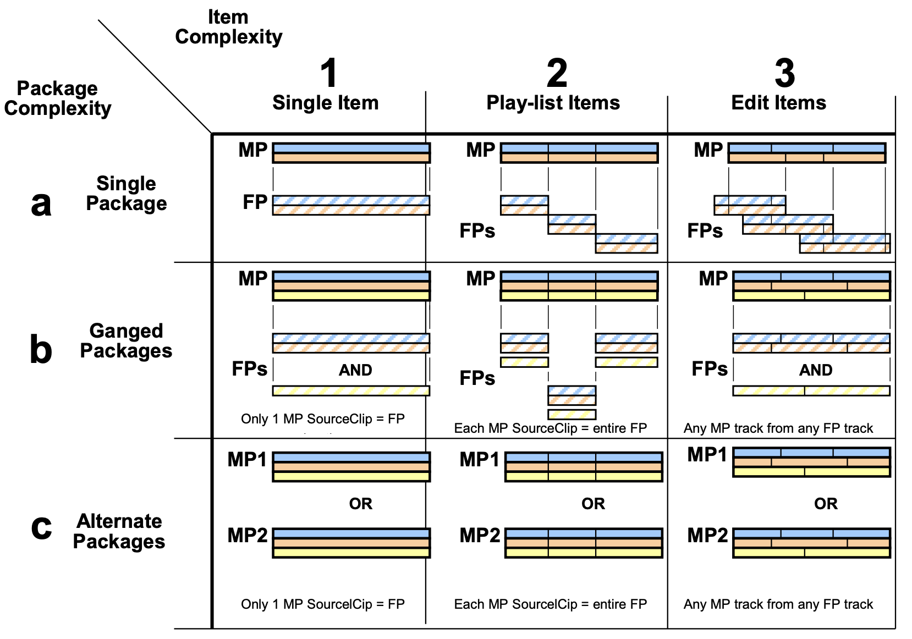

# Go MXF

Try to parse Material Exchange Format ([MXF](https://en.wikipedia.org/wiki/Material_Exchange_Format)) for learning purpose.

## Intro

An MXF file is strictly composed of a sequence of [KLV](https://en.wikipedia.org/wiki/KLV) packets (except for the Run-In sequence preceded the header for some specialized Operational Patterns).

> When parsing an MXF file, a decoder looks at the key and, if the key is known, reads the value and processes it; if the decoder does not recognize the key, it uses the length field to skip the data. [1]

### File Structure

```text
| File Header                         | File Body       | File Footer
|Header Partition Pack|Header Metadata|Essence Container|Footer Partition Pack
```

### MVP Decoder

> The concept of a minimum decoder is useful in defining the minimum behavior of any device which can be claimed to be MXF aware. The following is a list of required functionality [2]:
> 1. It must locate the first Key in the file and determine that it is the key of the Header Partition Pack (open or closed).
> 2. It must then locate, in the value fields of the Header Partition pack, the ULs for the Operational Pattern and the Essence Container, where present (some MXF files might have no Essence Container and be metadata only).
> 3. It must determine if the Operational Pattern UL is compatible with the capabilities of this decoder.
> 4. It must further determine if the Essence Container(s) UL is compatible with the capabilities of this decoder.
> 5. It must have a defined behavior (such as reporting an error) if the Operational Pattern or Essence Containers(s) are incompatible with its capabilities.

### Logics & Operational Patterns

> images of this section are all from ref [2]

- *Material Package* (timeline/tracks): A Generic Package Subclass that describes an output timeline of the MXF file
- *Source Clip*: Portion of a timeline/track
- *File Package*: A *Source Package* that strongly references a File Descriptor, which can be a *Top-Level File Package* (the direct file that MP pointed to) or a Lower-Level Source Package (historical annotations)





MXF Operational Pattern specifications define how the MXF File Format Specification can be configured to provide a defined application.



#### OP1a

MXF Operational Pattern 1a (OP1a) is a file format that contains a single playable essence, which can be a single essence element or interleaved essence elements.

OP1a is used as track files in Interoperable Master Format ([IMF](https://en.wikipedia.org/wiki/Interoperable_Master_Format)), which leaves the composition capability to CPL.

## Refs

- [1] [MXF - a technical overview](https://tech.ebu.ch/docs/techreview/trev_2010-Q3_MXF-2.pdf)
- [2] SMPTE ST 377-1:2019
- https://github.com/FFmpeg/FFmpeg/blob/master/libavformat/mxfdec.c
